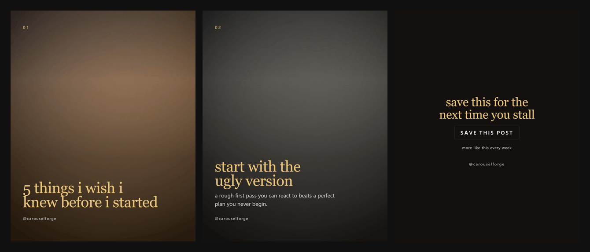
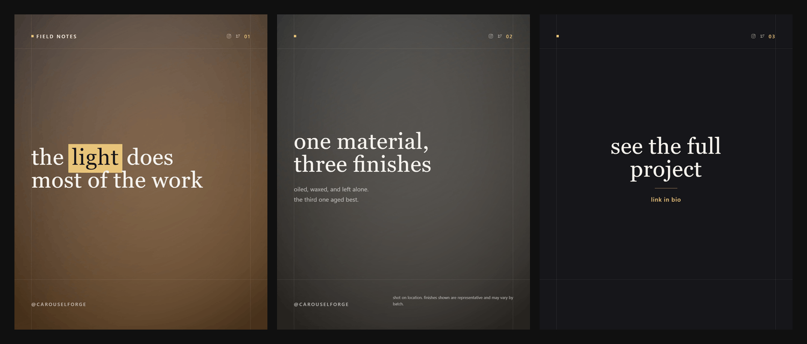
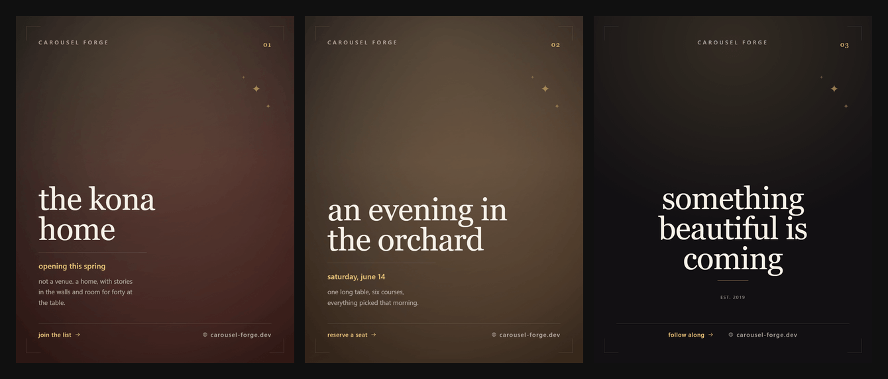

# carousel-forge

**A carousel is a piece of writing that happens to have pictures.** This is a
CLI for the writing part, with a renderer attached.

You describe a carousel in YAML. It renders 1080×1350 PNGs through headless
Chromium, byte-identical on every machine, ready to upload.

```
carousel.yaml  ─┐
images/         ├─►  carousel-forge build  ─►  out/slide-01.png … slide-07.png
narratives/     │                              out/contact-sheet.png
themes/<name>/ ─┘                              out/caption.md
```

Canva is a design tool that makes you a designer. This is a writing tool that
makes an agent your copywriter — and then renders the result consistently,
forever, from a file you can diff.

---

## Why it exists

Most carousels fail on slide 1. Not because the kerning is off — because the
hook is boring. So the interesting parts of this project are the ones that
have nothing to do with rendering:

- **Narratives** — reusable structures for what gets said and in what order.
  `viral-5` is hook → agitation → value → value → ask. Each role carries a
  purpose, a tone note, and a copy budget in words and lines.
- **Hook formulas** — a library of opening patterns in
  [`narratives/hooks.yaml`](narratives/hooks.yaml), with a worked example of
  each.
- **A doctor that reads the copy**, not just the pixels: over-budget slides, a
  missing call to action, two slides saying the same thing, a first slide that
  is a label rather than a hook.
- **A Copilot skill** —
  [`skills/instagram-carousel/SKILL.md`](skills/instagram-carousel/SKILL.md) —
  that turns "10 slides about why our sourdough takes 3 days" into a finished
  carousel, through a conversation.

### The CLI is dumb on purpose

`carousel-forge` will never write a hook for you, rewrite your sentence, or
generate a caption. `build` emits `caption.md` as an empty form; `doctor`
tells you a hook looks weak and points at the formula library, then stops.

Machine-generated marketing copy reads like machine-generated marketing copy.
The CLI stays deterministic and mechanical so you can trust it; the
intelligence lives in the agent driving it, or in you.

---

## Quickstart

```bash
npx carousel-forge init
npx carousel-forge build
open out/contact-sheet.png
```

`init` scaffolds `carousel.yaml`, drops generated placeholder photos in
`images/`, and gets out of the way. `build` renders every slide, a contact
sheet, and a caption scaffold. Fonts are downloaded once into a local cache
and inlined, so every build after the first is fully offline.

Then:

```bash
npx carousel-forge doctor     # lint the layout and the copy
npx carousel-forge preview    # contact sheet + a local server
npx carousel-forge build --watch
```

Requires Node 20+. Chromium is installed by Playwright:

```bash
npx playwright install chromium
```

### With an agent

Point a Copilot-compatible agent at
[`skills/instagram-carousel/SKILL.md`](skills/instagram-carousel/SKILL.md) and
describe what you want:

> 7 slides about why our sourdough takes three days. warm, a bit blunt.

It proposes three hooks, waits for you to pick one, writes `carousel.yaml`,
assigns your photos with focal points, builds, shows you the contact sheet,
and takes feedback like _"slide 4 is too long"_ or _"the hook is weak"_. That
conversational loop is the point of the project.

---

## Theme catalog

Three themes ship built in. All previews below are generated by
`node scripts/build-previews.mjs` — they are real renders, not mockups.

### `warm-editorial`

Full-bleed photograph, heavy gradient into the lower third, lowercase serif
headline in the accent colour. Photography-led, personal, warm. The default.



### `studio-minimal`

A light wash instead of a blackout, so the photograph keeps its colour. Faint
1px rules carry the structure; the headline sits at the optical centre with an
optional accent block behind one word. For product, interiors, architecture.



### `poster`

An announcement, printed. One very large serif headline, a hairline rule, a
narrow measure of copy, and a bottom bar with the call to action and the URL.



```bash
carousel-forge themes list
carousel-forge themes new my-theme --from warm-editorial
```

---

## Narratives

A **narrative** decides what gets said and in what order. A **theme** decides
how it looks. They never reference each other, so any narrative composes with
any theme.

```bash
carousel-forge narratives list --verbose
carousel-forge narratives hooks
```

| Narrative      | Shape                                              |
| -------------- | -------------------------------------------------- |
| `viral-5`      | hook → agitation → value ×n → cta                  |
| `listicle-10`  | hook → point ×n → cta                              |
| `before-after` | hook → before → turning-point → after → cta        |
| `story-arc`    | setup → tension → turn → resolution → lesson → cta |

Roles are assigned positionally, and flexible roles absorb extra slides — so
`viral-5` works at five slides or at ten. A slide can always name its own
`role:` to override that.

---

## `carousel.yaml` reference

```yaml
theme: warm-editorial # required — a directory in themes/
narrative: viral-5 # optional — a file in narratives/

brand: # optional
  logo: assets/logo.svg # path, inlined into the render
  handle: '@elmike.ca'
  name: 'el mike'
  url: 'elmike.ca'
  accent: '#E8C47A' # shorthand for tokens.accent
  ink: '#FFFFFF' # shorthand for tokens.ink
  tokens: # any theme token, overridden for the whole carousel
    titleSize: '96px'

defaults: # optional — applied to every slide
  overlay: 0.55 # 0 = photo untouched, 1 = fully obscured
  numbering: true # show the slide number

slides: # 1–20 slides
  - image: photos/kitchen.jpg
    focal: [0.4, 0.3] # where the subject is, as fractions of w and h
    overlay: 0.7 # per-slide override
    role: value # override the positional narrative role
    layout: default # override the layout the role asks for

    eyebrow: 'field notes' # small label above the title
    title: 'the kona home'
    highlight: 'kona' # word inside the title the theme may emphasise
    body: 'not a venue. a home. with stories.'
    bullets: ['one', 'two'] # alternative to body
    cta: 'save this post'
    note: 'fine print'

    imageB: photos/after.jpg # second photo, for split layouts
    focalB: [0.5, 0.5]
    labelA: 'before'
    labelB: 'after'

    numbering: false
    tokens: # tokens for this slide only
      accent: '#FF0000'
```

Everything is validated with zod. Errors name the file, the slide index, the
field and what was expected:

```
Problems found:
  - slides[3].focal: expected array, received number

  in carousel.yaml
  focal is a pair of fractions, e.g. focal: [0.4, 0.3] — 0 is the left/top
  edge, 1 the right/bottom edge.
```

### Token precedence

Theme tokens become CSS custom properties on `:root`, lowest to highest:

```
theme.json tokens  <  brand.accent / brand.ink  <  brand.tokens  <  slide.tokens
```

`fontDisplay` becomes `--font-display`. Themes read only custom properties,
never hardcoded values.

---

## Commands

|                                                                              |                                                   |
| ---------------------------------------------------------------------------- | ------------------------------------------------- |
| `init [--theme] [--narrative] [--dir]`                                       | Scaffold `carousel.yaml`, `images/`, `assets/`    |
| `build [--watch] [--out <dir>]`                                              | Render slides, contact sheet and caption scaffold |
| `preview [--port]`                                                           | Build, then serve `out/` on localhost             |
| `doctor`                                                                     | Lint layout and copy                              |
| `themes list` / `themes new <name> [--from]`                                 | Inspect and create themes                         |
| `narratives list [--verbose]` / `narratives new <name>` / `narratives hooks` | Inspect and create narratives                     |

### What `doctor` checks

**Layout**, measured against the rendered DOM and sampled from the actual PNG:
text crossing the safe area, text being clipped, two slots overlapping,
contrast between the words and the photo behind them, a title too small to
read in a grid preview, source photos below the canvas resolution, slots the
theme does not render, and carousels over 20 slides.

**Copy**, read from the source: a first slide that does not look like a hook,
no call to action anywhere, slides over their role's word and line budget,
required slots left empty, too many words on one slide, consecutive slides
repeating each other, and slide counts a narrative cannot express.

It reports and explains. It does not rewrite.

---

## Create your own theme

A theme is a directory. Nothing in core needs to change — if a design decision
is hardcoded in core, that is a bug.

```bash
carousel-forge themes new my-theme --from warm-editorial
```

```
themes/my-theme/
  theme.json      # tokens, canvas, safe area, declared slots, layouts
  template.html   # Handlebars, escaped by default
  theme.css       # all of the design
  fonts/          # optional theme-owned woff2, named Family-700italic.woff2
  preview.png     # optional, for a catalog
```

`themes/` in your project shadows the built-in themes, so you can fork one by
name.

**theme.json**

```json
{
  "name": "my-theme",
  "canvas": { "w": 1080, "h": 1350 },
  "safeArea": { "top": 80, "right": 72, "bottom": 120, "left": 72 },
  "tokens": {
    "accent": "#E8C47A",
    "ink": "#FFFFFF",
    "fontDisplay": "Playfair Display",
    "fontBody": "Inter"
  },
  "slots": ["eyebrow", "title", "body", "cta", "index", "logo"],
  "layouts": ["default", "hook", "value", "quote", "split", "cta"],
  "fonts": [{ "family": "Playfair Display", "weights": [400, 700] }],
  "lineBudget": { "title": { "maxLines": 3 } }
}
```

Declare `default` plus whatever layouts you want. A layout a narrative asks
for but your theme does not declare silently falls back to `default`, so every
theme works with every narrative from day one.

**template.html** receives one frame's context: `layout`, `role`, `index`,
`indexLabel`, `total`, `isFirst`, `isLast`, `numbering`, `overlay`, the slots
(`title`, `titleLines`, `titleParts`, `body`, `bodyLines`, `bullets`, …), the
brand (`handle`, `brandName`, `url`, `logo`), and `hasImage` / `hasImageB`.
Helpers: `eq ne gt lt not or and upper lower pad inc`.

Mark every text element the reader sees with `data-slot`:

```html
<h1 class="title" data-slot="title">
  {{#each titleLines}}<span class="line">{{this}}</span>{{/each}}
</h1>
```

That attribute is how `doctor` measures your theme without knowing anything
about it.

**theme.css** gets the token custom properties plus, from core:
`--canvas-w`, `--canvas-h`, `--safe-top/right/bottom/left`,
`--overlay-strength`, `--image`, `--image-b`. The layout name is a class on
`<body>` (`.layout-cta .slide { … }`), as is the narrative role
(`.role-hook`).

Photos are cropped to the exact canvas size by sharp before the browser sees
them, so `background-size: cover` never resamples.

## Create your own narrative

```bash
carousel-forge narratives new my-story --from viral-5
```

A narrative is one YAML file of roles. Each role names a `purpose`, a `tone`
note for whoever writes the copy, a `layout` hint, a copy budget, and how many
slides it may occupy:

```yaml
name: my-story
description: What this structure is for.
hooks: [wish-i-knew, contrarian]

defaults:
  copy:
    title: { maxWords: 7, maxLines: 3 }

roles:
  - id: hook
    purpose: stop the scroll
    layout: hook
    tone: Blunt and specific. No throat-clearing.
    requires: [title]

  - id: value
    purpose: deliver something usable
    layout: value
    repeat: { min: 2, max: 8 }
    requires: [title]

  - id: cta
    purpose: ask for the save
    layout: cta
    anchor: end
    requires: [cta]
```

`anchor: end` pins a role to the last slide whatever the slide count.
`repeat` lets a role absorb the slack.

---

## Determinism

Identical inputs produce byte-identical PNGs, on any machine, on any day:

- Chromium is pinned to the exact Playwright version in `package.json`.
- Photos are cropped and resized by sharp before rendering, so the browser
  never resamples an image.
- Fonts are fetched once into a local cache and inlined as base64
  `@font-face`, so rendering touches no network.
- The screenshot is re-encoded through sharp to strip timestamp and tooling
  chunks.

There is a test that renders the same carousel twice in two browser processes
and asserts the bytes match.

## Video readiness

Video is out of scope for v1 and is not implemented. The architecture does not
foreclose it:

- The renderer's unit of work is a **`Frame`** — a slide plus a time `t` — not
  a slide. In v1 every slide yields one frame at `t = 0`.
- Export goes through the **`OutputTarget`** interface. `PngTarget` ships; a
  `VideoTarget` would need no change to the render pipeline.
- `theme.json` may declare a `motion` block. v1 validates it and ignores it.

No encoding logic touches the theme engine.

---

## Using it as a library

```ts
import { build, doctor, loadProject } from 'carousel-forge';

const result = await build({ configFile: 'carousel.yaml', outDir: 'out' });

const project = await loadProject({ configFile: 'carousel.yaml' });
const report = await doctor({ project });
```

## Contributing

Themes and narratives are the most useful things to contribute. See
[CONTRIBUTING.md](CONTRIBUTING.md).

## License

MIT. Generated placeholder photos and the three shipped themes are part of
this repository and carry the same licence. No commercial fonts are committed:
Google Fonts are downloaded at build time into a local cache.
